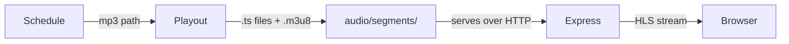
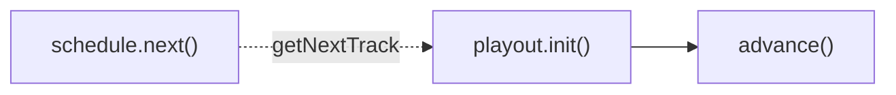

# Scheduler Architecture

## Overview

The scheduler turns mp3 files into a live **HLS** audio stream.

How does it work!? Roughly:

1. chunk tracks into **segments**, add segments to back of buffer
2. serve segments from front of buffer via sliding **window** (aka playlist in HLS terms)
3. go step 1 when [necessary](./playout.md#buffer-threshold) (_necessary = mathematically guarantee_ buffer has segments)

### High Level Flow

There are basically two pieces:

1. **[schedule](./schedule.md)**: responsible for what's coming up next
2. **[playout](./playout.md)**: responsible for what's being served now



### File Descriptions

```
Schedule
  schedule/schedule.ts          upcoming track list
Playout
  playout/playout.ts            buffer, tick loop, track transitions
  playout/segment.ts            ffmpeg: chunk into segments
  playout/window.ts             builds and writes the .m3u8 playlist (window)
  playout/config.ts             paths, HLS tuning, buffer threshold inputs
audio/segments/
  playlist.m3u8, t1_000.ts, t1_001.ts, t1_00x.ts
Express API
  api/audio/stream.ts           serves playlist (window) + segments
```

### How the Schedule feeds the Playout

This design intentionally decouples the schedule from the playout:

- The playout doesn't know where tracks come from
- The schedule doesn't know who consumes its tracks

When calling `playout.init()`, you pass in a function as the `getNextTrack` callback.
`advance()` uses this callback to pull tracks on demand.

The `schedule.next()` function is intended to be passed in here.



```
server.ts
  └─ app.init()
       ├─ playout.init(() => schedule.next())   -- callback injection
       └─ playout.start()
```

## HLS

HLS (HTTP Live Streaming) delivers audio over plain HTTP.

The client fetches a `.m3u8` playlist to discover which `.ts` segment files to subsequently fetch.
The client plays segments back-to-back.

To stream live:

1. The client re-fetches the playlist constantly (periodically).
2. The playlist is updated by the server periodically at a fixed rate.
   The updated playlist reflects the window which has just slid forward one segment.

In other words (to stream live):

- The client polls every `TARGETDURATION` seconds.
- Since `TARGETDURATION` is the max of all segment durations in the window,
  the server will always have ticked at least once by then.

You may wonder if the client could poll but the server hasn't written the new playlist to disk yet (race condition).
Well, that's why the [minimum window size is 3 segments](https://www.rfc-editor.org/rfc/rfc8216.html#section-6.2.2).

The generated `.m3u8` playlist metadata (the _window_) looks like:

```
#EXTM3U
#EXT-X-TARGETDURATION:1
#EXT-X-MEDIA-SEQUENCE:47
#EXTINF:1.000000,
segments/t0_047.ts
#EXTINF:1.000000,
segments/t0_048.ts
#EXTINF:0.834000,
segments/t0_049.ts
```

- `#EXT-X-MEDIA-SEQUENCE` increments each tick so the client can keep track of the current segment
- `#EXT-X-TARGETDURATION` is the ceiling of the longest segment in the window
- Omitting the `#EXT-X-PLAYLIST-TYPE` header means "live mode"

## References

- [RFC 8216: HTTP Live Streaming](https://www.rfc-editor.org/rfc/rfc8216.html) - the HLS specification
- [RFC 8216bis: HTTP Live Streaming (Draft)](https://datatracker.ietf.org/doc/html/draft-pantos-hls-rfc8216bis-20)
- [HLS Authoring Specification for Apple Devices](https://developer.apple.com/documentation/http-live-streaming/hls-authoring-specification-for-apple-devices) - Apple's implementation guide
