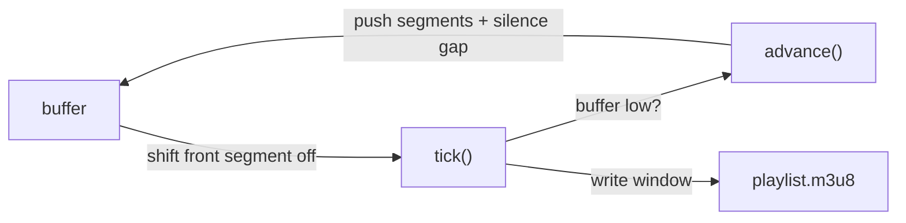
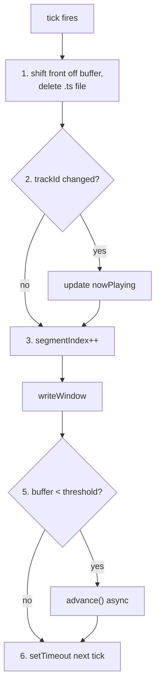
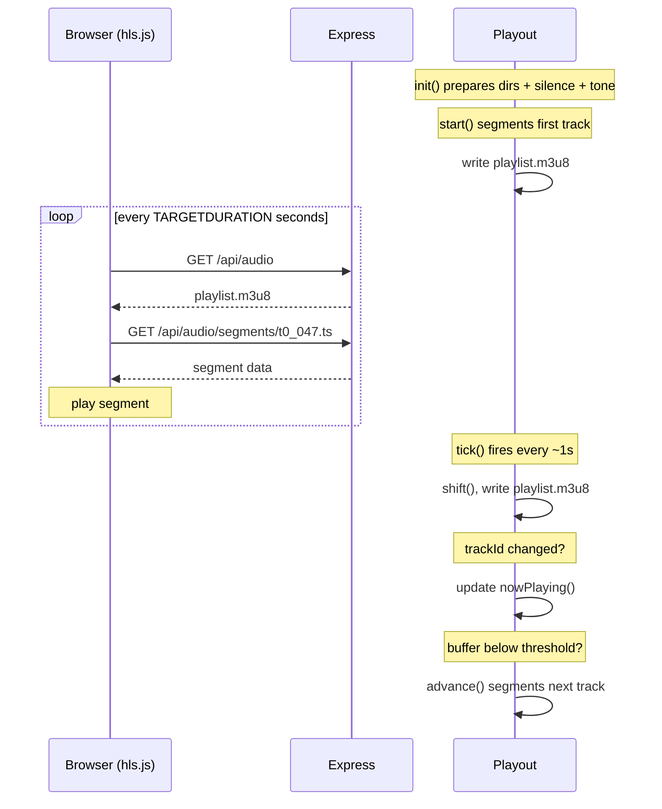
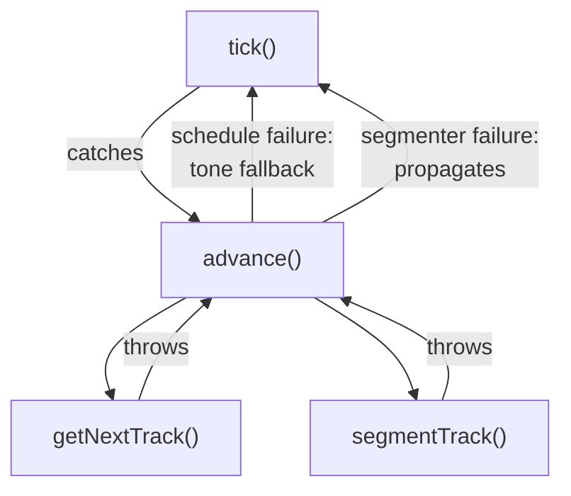

# Playout

"Playout" is a term used by the broadcast industry.
The **playout** is the real-time segment **buffer** and **tick** loop.

- The **buffer** is simply an array of segments. `advance()` fills it, `tick()` drains it.
  When the buffer drops below a threshold, `tick()` triggers another `advance()`.
- The **tick loop** is self-scheduling: each tick fires a `setTimeout` for the next segment's duration.

The playout is responsible for [guaranteeing](#buffer-threshold) there is a segment to stream.
The playout is also designed to [handle errors](#error-handling) such that it never dies.

## Data Structures

### Buffer

The buffer is an array of `Segments`.

Each `Segment` has:

- file path
- duration
- trackId

The `Segment` type is defined as `SegmenterOutput & { trackId: number }`.
In other words, the playout adds a `trackId` onto the raw segmenter output.

Silence segments share the `trackId` of the track they follow.

The table below is an example of buffer indices and the content in them:
|index| 0 | ... | 89 | 90 | 91 | 92 | 93 | ... | 147 | 148 | 149 | 150 | ... |
|--| ------- | --- | ------ | --- | --- | --- | ------- | --- | ------ | --- | --- | --- | --- |
|path| t0_000 | ... | t0_089 | sil | sil | sil | t1_000 | ... | t1_054 | sil | sil | sil | ... |
|dur| 1 | 1 | 0.8| 1| 1| 1| 1| 1| 0.7| 1| 1| 1| ... |
|id| track 1 | | | | | | track 2 | | | | | | |

The buffer is a FIFO: `advance()` pushes onto the back, `tick()` shifts off the front.

### Window

| tick |            |            |            |        |        |     |
| ---- | ---------- | ---------- | ---------- | ------ | ------ | --- |
| 0    | **t0_000** | **t0_001** | **t0_002** | t0_003 | t0_004 | ... |
| 1    | **t0_001** | **t0_002** | **t0_003** | t0_004 | ...    |     |
| 2    | **t0_002** | **t0_003** | **t0_004** | ...    |        |     |

The sliding window is always the first WINDOW_SIZE elements of the buffer.
Each tick shifts off the front segment and deletes that file, then writes a new window (playlist.m3u8).

## Other Functionality

## Now Playing

`nowPlaying()` returns the mp3 path of the current track.

It updates during `tick()` when the shifted segment's `trackId` differs from the next.

Since silence segments share the preceding track's `trackId`:
`nowPlaying` changes when the next track segments begin.

## Buffer Threshold

The buffer depth is checked on every `tick()`.
When it drops below `BUFFER_THRESHOLD`, `advance()` fires asynchronously to segment the next track.

The `BUFFER_THRESHOLD` is computed from `MAX_TRACK_DURATION`, `FFMPEG_THROUGHPUT`, and `SAFETY_MARGIN`.
In other words: based on the maximum length of a track and a worse-case estimate of how long it takes to segment a track, we can determine when we need to segment the next track. We also include a safety multiplier because engineering.

This keeps the buffer deep enough to survive ffmpeg's worst-case latency.
The `isAdvancing` flag prevents concurrent advance calls.

## Lifecycle

### Startup: `init()` + `start()`

`init()`

1. wipes the segments directory
2. generates the silence segment & fallback tone
3. receives the `getNextTrack` callback

`start()`:

1. calls `advance()` once for the first track
2. writes the initial window
3. kicks off the tick loop

### Tick

The frequency of the tick is based on the duration of a segment.

1. Shift the front segment off the buffer and delete its file
2. Detect track transition: if the `trackId` changed, update `nowPlaying`
3. Increment the segment index
4. Write a new window (playlist.m3u8)
5. If buffer below threshold, fire `advance()` asynchronously
6. Schedule the next tick

### Advance

Triggered by `tick()` when the buffer drops below `BUFFER_THRESHOLD`.

Segments a single track supplied by `getNextTrack()`.
Stamps each chunk with a `trackId` and pushes the segments onto the buffer.

## Client-server Interaction

## Error Handling

In short...
The stream never dies. `tick()` always catches:

- Bad audio files are skipped.
- If the schedule has nothing left, a fallback tone plays.

- **tick**:
  - Catches failed advances so the stream survives. Existing buffer has plenty of time.
    - Next tick is still below threshold and triggers advance again.
      - The schedule is tried again.
        - Either there is more in the schedule, or the tone fallback fills the buffer and the stream continues.
- **advance**:
  - **segmenter error**: throws on ffmpeg failure
  - **schedule error**: throws if the queue is empty and no fallback exists

## Design Notes

### Callback Injection

The playout receives `getNextTrack` as a function parameter (see [How they connect](./architecture.md#how-the-schedule-feeds-the-playout)).
This decouples track selection from the real-time segment buffer.

The schedule is a pull-based source:
the playout asks for tracks when it needs them, the schedule doesn't push.
