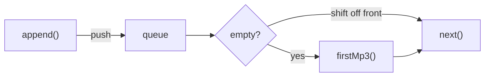

# Schedule

The schedule right now is very simple. It's a list of strings: a list of paths to mp3 files.
It doesn't know anything about the playout. It can simply provide the next path when asked.

The schedule is also a FIFO like the playout [buffer](./playout.md#buffer).
`next()` pops the front or calls the fallback function if empty.

The schedule is currently hard-coded to default to `firstMp3()` as a fallback when the queue is empty.

The `next()` function is intended to be passed into the playout as the `getNextTrack` callback.
See [How the Schedule feeds the Playout](./architecture.md#how-the-schedule-feeds-the-playout) for more details.

## Future

Later, the schedule could be more complicated:

- there could be a `Track` object (class wrapper around an mp3 file)
- you could make a `Playlist` object that includes multiple `Track`s
